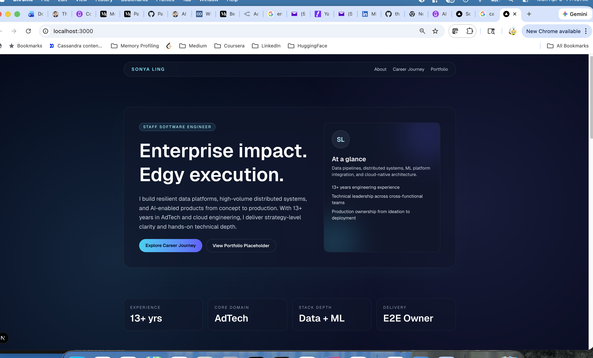
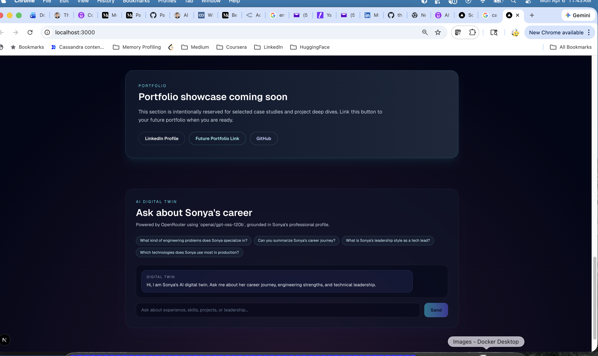

## Site - Digital-Twin

This is my first AI coding project - digital-twin.  I used cursor implemented with GPT-5.3 Codex and reviewed by Anthropic Opus 4.6 and of course I reviewed it to my satisfaction.  It has sleek look and the AI chat Q&A quality (stick to source of truth) is pretty good. I think that I gradually gain some confidence on AI coding and consider AI as my assistant and extends my capability.  However, I and AI coding might be in Honeymoon period :. More to come. Let's see.

The followings are two screenshots.




Both 'tutorial.md' and 'review.md' are under /web sub-folder.

When I have a chance, I will review Ed's Production Track course material to see if I can put together Vercel configuration and deploy to Vercel.

This is the history of my instructions for my own record too:

```
Please build me a professional website running locally.  My linkedin profile is profile.pdf  Make my website stunning: enterprise meets edgy.  It should include about me, my career journey and a link to my portfolio (for future).  Iterate to make it as slick and professional as possible,  Use Next.js.  
```

```
That's great. Please now add the ability to have an AI chat with a "digital twin" that can answer questions about  my career.  Please use OpenRouter.  My OPENROUTER_API_KEY is in ".env" file.  Please use a model name "openai/gpt-oss-120b".  Go ahead to plan and make changes.  Make sure it works. Let me know when it is ready.
```

```
Look great!!  I see the problem.  Yes, Please render markdown in reponse and also add chat streaming. 
```

```
K.  Can you use read the full content of profile.pdf as the DIGITAL_TWIN_KNOWLEDGE instead?  The current DIGITAL_TWIN_KNOWLEDGE is incomplete.
```

```
Yes, Your response now is derived from the full content of "profile.pdf".  One more issue.  I am seeing HTML "<br>" in the response.  Can you render HTML '<br>' as a single line break in the response?  Thanks.
```

```
1. As you can see, it does not format Agents section in 3 column format well. You can simplify not to use a format of 3 columns as long as the response is readable and displays cleanly.
2. You need to give LLM much explicit instructions: Stick to the topic.  For example, do not retrieve and include the content from my "AI Engineer Production Track: Deploy LLMs & Agents at Scale" course  if I ask for the details of "Agentic RAG" project only.   
```

```
Please write a comprehensive tutorial in markdown called tutorial.md that is suitable for a beginner in frontend coding. Include a summary of technology, a high-level walk through, and detailed code review with code samples. End with 5 suggestions for ways that codes could be improved based upon a self review.   
```

```
Please do a comprehensive code review of this project and write the result to review.md including any remedial actions needed.  DO NOT actually change any code.
```

```
There are 3 high-priority remedial action plan that I like you plan and make changes.

1. Add rate limiting to POST /api/digital-twin. A simple in-memory sliding window (e.g., max 20 requests per minute per IP) prevents runaway credit burn.

2. Add a test framework and initial tests. Install vitest. Write unit tests for extractSection, buildFocusedProfileContext, extractProjectEntries, pickBestProjectEntry, and normalizeAssistantMarkdown.

3. Add AbortSignal.timeout(30_000) to the OpenRouter fetch to prevent hanging requests.
```

```
Yes, can you add a short TESTING.md, with instructions and examples for running a specific test file or test case.
```
